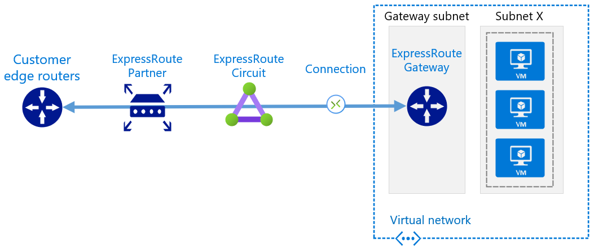
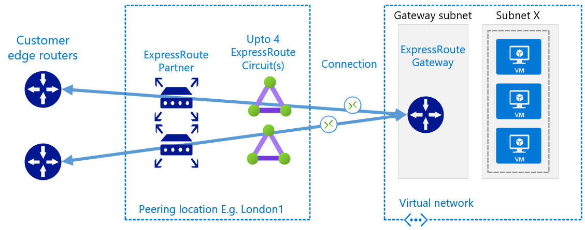
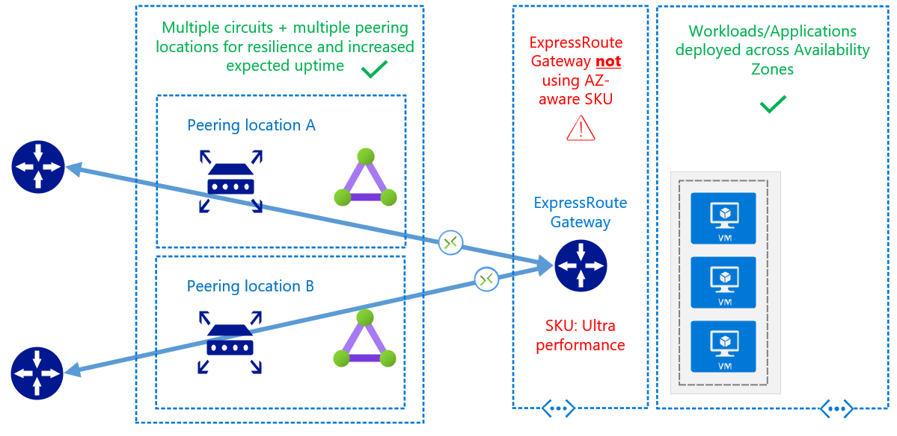
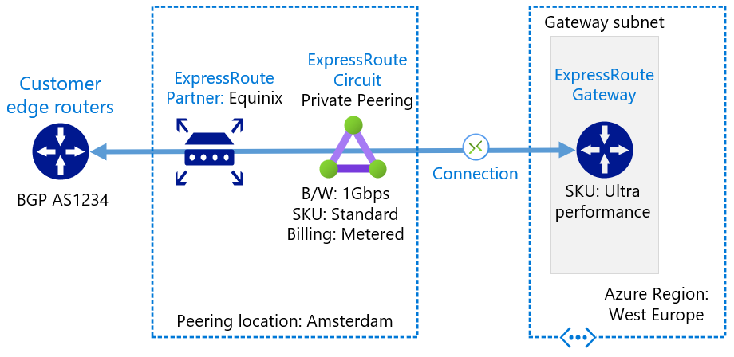
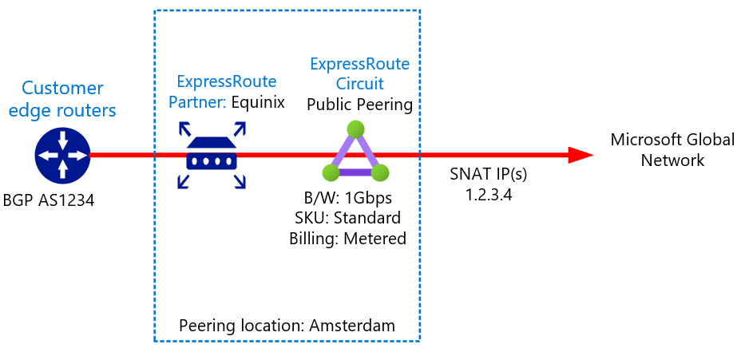
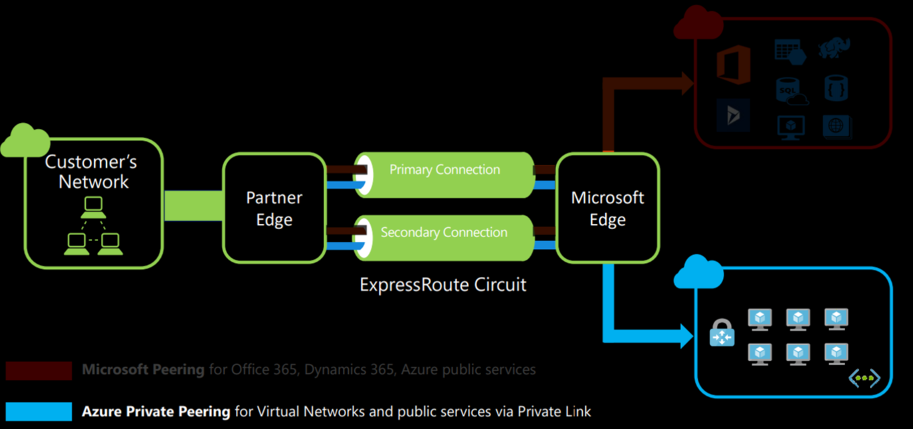
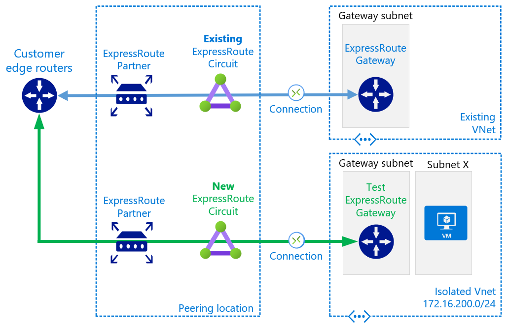
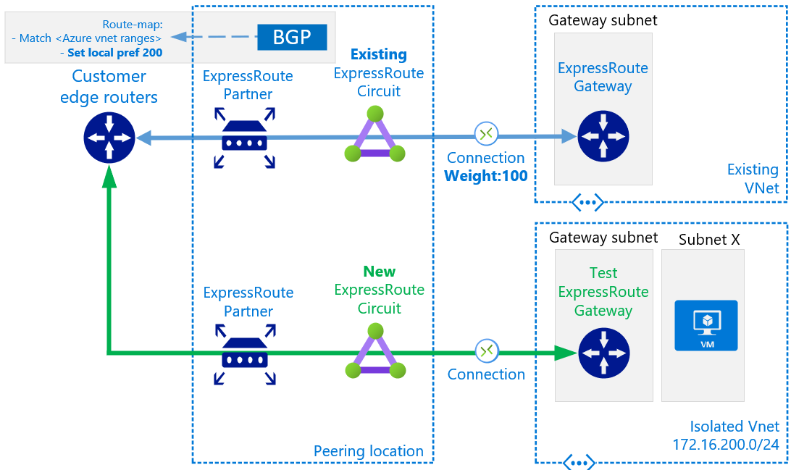
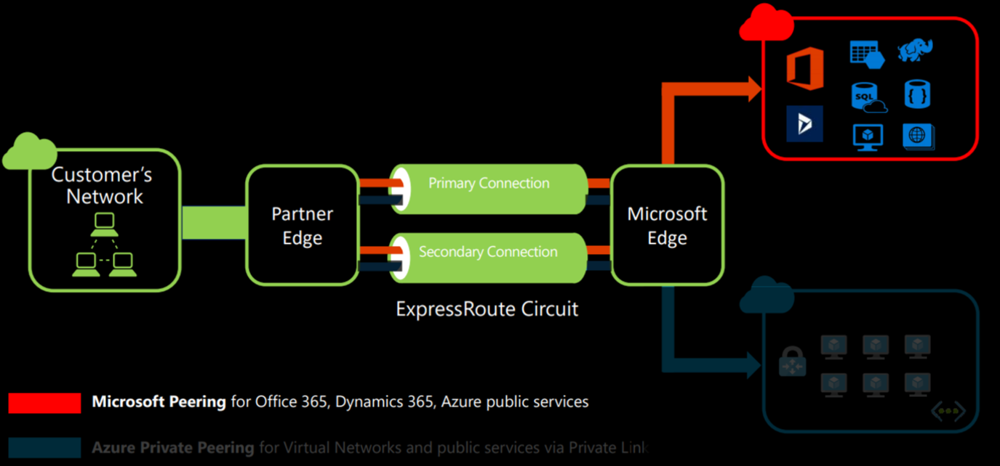

 # ExpressRoute migration guide

 ## Contents

<!-- TOC -->

- [1. Introduction](#1-introduction)
- [2. Context](#2-context)
    - [2.1. Good to know](#21-good-to-know)
    - [2.2. Good to consider](#22-good-to-consider)
    - [2.3. Capture existing configuration](#23-capture-existing-configuration)
- [3. Private Peering Migration](#3-private-peering-migration)
    - [3.1. Create new ExpressRoute circuit](#31-create-new-expressroute-circuit)
    - [3.2. Create test Virtual Network and link to circuit](#32-create-test-virtual-network-and-link-to-circuit)
    - [3.3. Pre-provision circuit authorizations](#33-pre-provision-circuit-authorizations)
    - [3.4. Configure BGP routing to favour existing circuit](#34-configure-bgp-routing-to-favour-existing-circuit)
    - [3.5. Connect new circuit to existing ExpressRoute Gateway](#35-connect-new-circuit-to-existing-expressroute-gateway)
    - [3.6. Move traffic to new ExpressRoute circuit](#36-move-traffic-to-new-expressroute-circuit)
    - [3.7. Rollback](#37-rollback)
    - [3.8. Cleanup](#38-cleanup)
    - [3.9. Migrating multiple circuits](#39-migrating-multiple-circuits)
- [4. Public/Microsoft Peering Migration](#4-publicmicrosoft-peering-migration)
- [5. Further reading and useful links](#5-further-reading-and-useful-links)

<!-- /TOC -->

# 1. Introduction

Many customers on Azure leverage ExpressRoute for reliable hybrid connectivity. Sometimes these same customers may need to implement a new ExpressRoute circuit, and have a desire to decommission their old circuit. Common drivers for this scenario include:

- Mergers and acquisitions resulting in consolidation of network providers
- A change of ExpressRoute provider or incumbent WAN provider
- [Downgrading an ER circuit bandwidth requires a new circuit](https://docs.microsoft.com/en-us/azure/expressroute/)expressroute-faqs#can-i-change-the-bandwidth-of-an-expressroute-circuit
- Upgrading an ER circuit can [sometimes](https://docs.microsoft.com/en-us/azure/expressroute/expressroute-faqs#can-i-change-the-bandwidth-of-an-expressroute-circuit) require a new circuit, depending if the existing underlying port has capacity to support the bandwidth increase 

This guides suggest an approach to this migration process that focuses on seamless failover, de-risking rollback, and understanding the correct ordering of steps. Each step will require you to leverage your existing knowledge of ExpressRoute, links will be provided to Azure documentation as required for further technical depth. 

:warning: This document assumes pre-existing knowledge of Azure, ExpressRoute and BGP. It is not designed to be read in isolation, but rather act as a high level guide, pointing you in the right direction, at the right places and get the project team asking the right questions to plan for success.

# 2. Context

When having any ExpressRoute discussion its beneficial to agree on terms. This is best visualized in layers, highlighting the different components in any ExpressRoute design; 

- **Gateway**; lives in the GatewaySubnet in your Virtual Network (VNet)
- **Connection**; connects your **Gateway** to a
- **Circuit**; the logical configuration at the Microsoft edge network, used to connect your network to ours. **Not** located in the Azure Region, lives in the Peering Exchange, aka Edge site, aka PoP. Owned by companies like NGN, Equinix and Telehouse.
- **Partner**; The company helping you bridge the gap bewteen your network and Microosfts by faciliating, most commonly, a collection of virtual layer-2 circuits, which you connect to
- **Customer**; Your devices, most often used for Layer-3 BGP termination.

Customer/partner lines may blur, also [ExpressRoute Direct](https://docs.microsoft.com/en-us/azure/expressroute/expressroute-erdirect-about) removes the Partner layer. 



This document presents migration steps with a simple scenario in mind; _"I have one existing ExpressRoute circuit, I am implementing a new ExpressRoute circuit, how do I get from A to B?"_. The logic and approach herein can be used for more complex scenarios involving multiple circuits (before or after migration), multiple Azure regions and/or multiple ExpressRoute Gateways.

## 2.1. Good to know

Up until ~2019 it was only possible to connect a unique peering location to an ExpressRoute Gateway with a single ExpressRoute circuit. I.e. you could link multiple circuits to an ER Gateway, but they had to be from different peering locations. Today, this limit is raised, we are able to simultaneously link up to 4 circuits from the same peering location to an ExpressRoute gateway. This gives us more flexibility when planning the approach to migration.

I.e. the following _is_ now [possible](https://docs.microsoft.com/en-us/azure/expressroute/expressroute-about-virtual-network-gateways#aggthroughput).



## 2.2. Good to consider

If, as part of your ExpressRoute migration project, you are implementing more circuits for resilience, make sure to also consider the [ExpressRoute Gateway SKU](https://docs.microsoft.com/en-us/azure/expressroute/expressroute-about-virtual-network-gateways) you are using. This should be fit for purpose and aligned with your resilience and performance goals. If you are scheduling maintenance windows to upgrade your circuit, now could be a good time to plan for Gateways changes, if they are required. 

A common ExpressRoute anti-pattern (don't do this :) ):



## 2.3. Capture existing configuration

Before removing the old connectivity, we should capture its logical configuration and form a baseline diagram to iterate from. Important information includes;

- Which Azure regions are being used, E.g. West Europe
- ExpressRoute Gateway [SKU](https://docs.microsoft.com/en-us/azure/expressroute/expressroute-about-virtual-network-gateways#gwsku), e.g. _High_, or _ERGw1Az_ 
- ExpressRoute connection objects (the things that link a _gateway_ to a _circuit_ within the same subscriptions)
- ExpressRoute authorisations (the things that link a _gateway_ to a _circuit_ within a [different subscription](ttps://docs.microsoft.com/en-us/azure/expressroute/expressroute-howto-linkvnet-arm#circuit-owner-operations)) 
- ExpressRoute circuit attributes
  - Peering location, e.g. London1
  - Bandwidth, e.g. 1Gbps
  - Provider, e.g. Equinix
  - SKU, e.g. Standard/Premium/Local
  - Billing Model, e.g. Unlimited/Metered
- ExpressRoute circuit peering types
  - Private peering *(the majority of customers will only be using this peering type)*
  - Public Peering (now deprecated, but may still be in use in your network)
    - Public Peering utilises Microsoft managed SNAT ranges. If you do not know this [SNAT information](https://docs.microsoft.com/en-us/azure/expressroute/expressroute-nat#nat-requirements-for-azure-public-peering), you will need to raise an Azure support ticket to find out your SNAT addresses 
  - Microsoft Peering
    - Microsoft peering utilises [customer managed SNAT](https://docs.microsoft.com/en-us/azure/expressroute/expressroute-nat#nat-requirements-for-microsoft-peering), you or your provider will have this information. 
    - [Route filters](https://docs.microsoft.com/en-us/azure/expressroute/how-to-routefilter-portal) associated with Microsoft peering 
- [BGP information](https://docs.microsoft.com/en-us/azure/expressroute/expressroute-routing) -  AS numbers and /30 peer IP addresses for all peerings 

Once this is complete, you should be able to produce two diagrams similar to the below, splitting out the Private Peering and the Public/Microsoft Peering for clarity.





# 3. Private Peering Migration



## 3.1. Create new ExpressRoute circuit

https://docs.microsoft.com/en-us/azure/expressroute/expressroute-howto-circuit-portal-resource-manager

Follow the above guide to create the new circuit with your requirement parameters. This includes working with your provider to turn-up the new circuit and configure the BGP peerings to your network. The /30 BGP links will utilise new, unique IP addressing.

<image>

## 3.2. Create test Virtual Network and link to circuit



- [Create a new VNet](https://docs.microsoft.com/en-us/azure/expressroute/expressroute-howto-linkvnet-arm) with some test IP address space that does not overlap with either your current on-premises address space, or your existing Azure VNet(s) address space
- Deploy, for testing purposes,  both a Virtual Machine and an ExpressRoute Virtual Network Gateway
- Connect the test Gateway to your new circuit via a Connection object
- The purposes of this step is to prove out end-to-end connectivity across the new circuit, prior to using it within your production environment. 
- If done correctly, your On-Premises network can now route traffic to this new test VNet, and vice versa 
- Carry out part of your required commissioning tests, latency, throughput etc


> Take this opportunity to become familiar with all the rich ExpressRoute information that is available from the CLI. For example, a good idea at this step is to verify you are advertising all the required routes from On-Premises with the expected as-path manipulation, if any. A great guide to get started https://blog.cloudtrooper.net/2021/07/12/cli-based-analysis-of-an-expressroute-private-peering/

## 3.3. Pre-provision circuit authorizations

If you are using circuit authorizations for cross-subscription gateway attachment (you checked that already right? ;) ) Then you are able to deploy these ahead of time on the new circuit. Generate the new authorsations and they will remain in the "available" state until redeemed at the gateway level. One less job to do during the migration window itself. 


## 3.4. Configure BGP routing to favour existing circuit



Before we attach our new circuit to the production ExpressRoute Gateway, we want to ensure that traffic only fails over to this circuit when _we_ decide, and not unexpectedly due to routing logic we may have full visibility of. We want to do this to ensure that traffic to and from Azure remains symmetrical, this is especially important if On-Premises stateful firewalls are in use.

- To control traffic from **Azure to On-Premises** the most straight forward method is to change the Weight parameter, configured at the Connection object level. The default is 0, a higher weight wins, therefore lets set our existing connection to 100.


- An alternative method to control traffic from **Azure to On-Premises** is to use as-path-prepend from On-Premises in the direction of Azure - [full details](https://docs.microsoft.com/en-us/azure/expressroute/expressroute-optimize-routing). Here is an example of a circuit that is receiving as-path-prepended routes from an On-Premises router. 


- To control traffic from **On-Premises to Azure** you will need to use BGP metric tuning - typically as-path-inbound, or local preference, depending on exact topology of your Customer edge routers. Configure a route-map on your on-premises router. Leverage this route-map to manipulate BGP metrics on routes recieved from Azure via the existing blue circuit. E.g. Configure your route-map to set Local Preference to 200. (Higher local pref wins, default is typically 100)

> Note! At this stage the circuit is still not connected to your ExpressRoute Gateway, but you have verified the route advertisements and attributes. 

## 3.5. Connect new circuit to existing ExpressRoute Gateway

<imagme>

At this point we have a high degree of confidence in the new circuit; we have proved end-to-end connectivity and we understand, and are in control of, the routing behaviour on the existing circuit, we can attach the new circuit to operate in a **standby/passive state**.

- Create a new connection object that links your new circuit to your ExpressRoute Gateway, **ensure the Weight is set to 0**. 
- Now is the time to also redeem the authorsations you created in an earlier step, effectively building connections from your circuit to gateways that reside in different subscriptions. Again, don't forget to set Weight to 0.
- Verify, using AZ CLI, that the ExpressRoute gateway sees your on-premises prefixes via both circuits, and if using as-path manipulation inbound, that the as-path attributes are as you expect. 

_The example below shows my On-Premises prefix of 192.168.2.0/24 being learnt via 4 BGP neighbours (each ER circuit is represented by peerings to the Gateway), representing my lab configuration that uses two ER circuits._ 

> Note visibility of BGP route metrics including as-path and weight (additive beyond baseline of 32xxx), allowing you to verify configuration changes made in step 3.4.

```
az network vnet-gateway list-learned-routes -n ER-GW-WE -g GBB-ER-LAB-WE -o table
Network            Origin    SourcePeer    AsPath                               Weight    NextHop
-----------------  --------  ------------  -----------------------------------  --------  ----------
192.168.2.0/24     EBgp      10.10.1.6     12076-65000-65001-65001-65002        32869     10.10.1.6
192.168.2.0/24     EBgp      10.10.1.7     12076-65000-65001-65001-65002        32869     10.10.1.7
192.168.2.0/24     EBgp      10.10.1.5     12076-65000-65001-65001-65001-65002  32769     10.10.1.5
192.168.2.0/24     EBgp      10.10.1.4     12076-65000-65001-65001-65001-65002  32769     10.10.1.4
```

## 3.6. Move traffic to new ExpressRoute circuit

Up to now we have been in the verification and test phase, but now its time to move production traffic on to our new circuit. At this point you have two options;

- a) Delete the connection object that links your old circuit to your ExpressRoute Gateway. In effect forcing traffic to/from Azure over your new circuit. This will incur downtime whilst the logical network routing catches up; between 10s to ~240s depending on the configuration of your On-Premises network and existing ER circuit. The main toggle to speed this process up, is BFD. https://docs.microsoft.com/en-us/azure/expressroute/expressroute-bfd

- b) Modify weight and AS-path to preference the new circuit. By repeating the process used above to de-preference the new circuit, we can use the same tools to de-preference the old circuit. I.e. we set Weight to 200 on the connection object to our new circuit, and in parallel change our On-Premises route-maps to as-path-prepend on the existing ER circuit, and remove this from the new circuit. In my testing this approach can result in a more seamless failover and less downtime, but your mileage may vary, depending on your On-Premises network setup.

Which approach you choose will depend on factors that include;

- Who is driving the migration? I would suggest that you always need your On-Premises network team on standby, but option (a) allows the cut-over to be initiated entirely from Azure.
- Are any On-Premises firewalls being used? Option (a) guarantees symmetrical traffic, whilst option (b) may result in temporary asymmetry due to BGP propagation timing
- Appetite for downtime. Option (a), whilst simpler, does come with the guaranteed downtime whilst BGP re-converges. Option (b) is more complex, but may offer a more seamless cut-over experience

## 3.7. Rollback

What if you've done the previous step and things are not working? Your app owners are still reporting problems after a period of UAT, and you need to press the "go back" button? 

- If you went with option (a), reconnect the old circuit by re-creating a connection object that links the old circuit to the ExpressRoute gateway.

- If you went with option (b), reverse your weight and as-path changes.

## 3.8. Cleanup

Once you are happy the migration was a success, don't forget to ask your provider to decommission your old ExpressRoute circuit, once this is complete you can delete the ExpressRoute object itself in the Azure portal. You can also remove the test VNet and associated resources.

## 3.9. Migrating multiple circuits

Up to this point, and to keep the guidance clear, the discussion has been focused narrowly on a simple scenario of migrating one existing circuit to one new circuit.

However, you may have a requirement to complete the above steps for more than one circuit, for example you may already be using resilient circuits (deployed across multiple ER PoPs) https://docs.microsoft.com/en-us/azure/expressroute/designing-for-disaster-recovery-with-expressroute-privatepeering#large-distributed-enterprise-network. 

If this is the case you can use the above logic in a staged approach. Migrating traffic away from your existing circuit-A, and then circuit-B, leaving circuit-C and circuit-D in operation. E.g.

<image>

# 4. Public/Microsoft Peering Migration



Public Peering is now deprecated but you may still be using this service on your old circuit. If you wish to retain access to Public IPs from Microsoft over your ExpressRoute connection, you will need to implement the Microsoft peering on your new circuit.

> Note! Now is a good time to assess what you are using the existing Public or Microsoft peering for. Many customers find that with platform enhancements in recent years such as **Azure Private Link**, the requirement to utilise the Microsoft peering is greatly reduced.

The process for migrating from Public Peering to Microsoft Peering is already well documented - https://docs.microsoft.com/en-us/azure/expressroute/how-to-move-peering - this methodology can be followed when implementing a new circuit.

:warning: Key call outs :warning:

- If you are moving from Public to Microsoft peering your SNAT IP addresses **will** change, therefore any IP allowed-lists (for example on Azure Storage firewall) will require updating prior to cutover.
- To obtain your existing Microsoft SNAT IP addresses used on the Public Peering, raise an Azure support ticket
- When initially configured, you will receive no routes on the Microsoft Peering. Only when attaching a _route filter_ will you start to recieve prefixes from Microsoft. https://docs.microsoft.com/en-us/azure/expressroute/how-to-routefilter-portal. 
  - You can use this to your advantage, initially selecting only one obscure BGP community, to validate route advertisements are functioning. 
  - Once this is complete, you can then select the wider range of services (BGP communities) that you require. 
  - This approach allows a controlled migration, on a per service basis if you desire, when combined with BGP attribute manipulation (as-path-prepend inbound, or local-preference).-

  
# 5. Further reading and useful links

https://docs.microsoft.com/en-us/azure/expressroute/designing-for-high-availability-with-expressroute

https://docs.microsoft.com/en-us/azure/expressroute/designing-for-disaster-recovery-with-expressroute-privatepeering#large-distributed-enterprise-network

https://docs.microsoft.com/en-us/azure/expressroute/expressroute-faqs

  