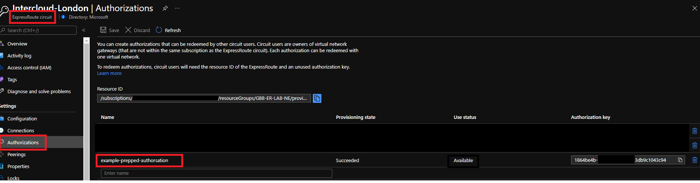
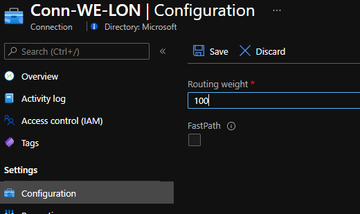
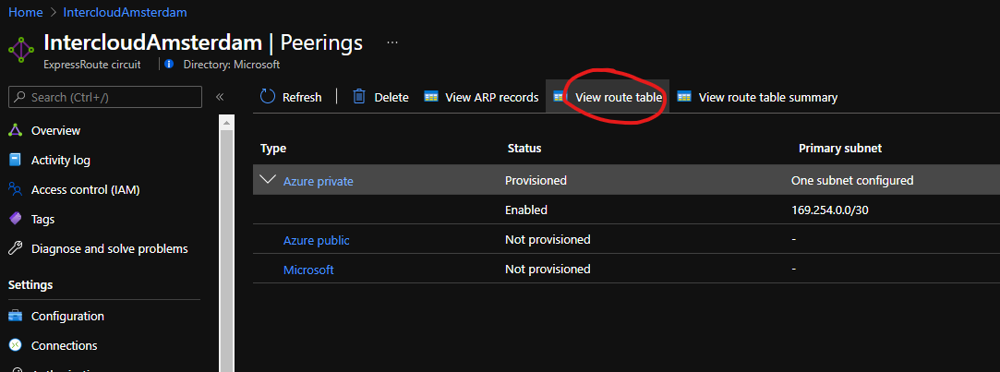
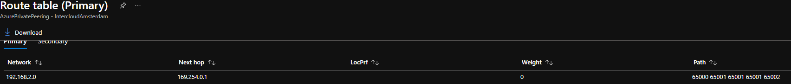

# ExpressRoute migration guide

# Contents

- [Introduction](#introduction)
- [Option 1 – Code the complexity](#option-1---code-the-complexity)
- [Option 2 - 3rd party GSLB Network Virtual Appliance (NVA)](#option-2---3rd-party-gslb-network-virtual-appliance--nva-)
- [Option 3 - Azure Traffic Manager](#option-3---azure-traffic-manager)
- [Option 4 - Azure Front Door](#option-4---azure-front-door)
- [Option 5 - Azure Load Balancer](#option-5---azure-load-balancer)
- [Option 6 - Application Gateway](#option-6---application-gateway)
- [Closing](#closing)

# Introduction

Many customers on Azure leverage ExpressRoute for reliable hybrid connectivity. Sometimes these same customers may need to implement a new ExpressRoute circuit, and have a desire to decommission their old circuit. Common drivers for this requirement include:

- Mergers and acquisitions resulting on consolidation of network providers
- A change of ExpressRoute provider
- Downgrading an ER circuit bandwidth requires a new circuit https://docs.microsoft.com/en-us/azure/expressroute/expressroute-faqs#can-i-change-the-bandwidth-of-an-expressroute-circuit
- Upgrading an ER circuit can sometimes require a new circuit, depending if the existing underlying port has capacity to support the bandwidth increase https://docs.microsoft.com/en-us/azure/expressroute/expressroute-faqs#can-i-change-the-bandwidth-of-an-expressroute-circuit

This guides suggest an approach to this migration process that focuses on seamless failover, de-risking rollback, and understanding the correct ordering of steps. Each step will require you to leverage existing knowledge of ExpressRoute, and also links will be provided to go in to more technical detail using Azure documentation. 

# Context

When having any ExpressRoute discussion its beneficial to agree on terms. This is best visualized in layers, highlighting the different components in any ExpressRoute design; 

- Gateway
- Connection
- Circuit
- Partner
- Customer

<image>

# Capture existing configuration

Before removing the old connectivity, we should capture its logical configuration and form a baseline diagram to iterate from. Important information shown in the example diagram below includes;

- Which Azure regions are being used, E.g. West Europe
- ExpressRoute Gateway SKU, e.g. "high", or "ERGw1Az" https://docs.microsoft.com/en-us/azure/expressroute/expressroute-about-virtual-network-gateways#gwsku
- ExpressRoute connection objects (the things that link a _gateway_ to a _circuit_ within the same subscriptions)
- ExpressRoute authorisations (the things that link a _gateway_ to a _circuit_ within a different subscription) https://docs.microsoft.com/en-us/azure/expressroute/expressroute-howto-linkvnet-arm#circuit-owner-operations
- ExpressRoute circuit attributes
  - Peering location, e.g. London1
  - Bandwidth, e.g. 1Gbps
  - Provider, e.g. Equinix
  - SKU, e.g. Standard/Premium/Local
  - Billing Model, e.g. Unlimited/Metered
- ExpressRoute circuit peering types
  - Private peering *(the majority of customers will only be using this peering type)*
  - Public Peering (now deprecated, but may still be in use in your network)
    - Public Peering utilises Microsoft managed SNAT ranges. You will need to raise a support ticket to find out your SNAT address. https://docs.microsoft.com/en-us/azure/expressroute/expressroute-nat#nat-requirements-for-azure-public-peering
  - Microsoft Peering
    - Microsoft peering utilises customer managed SNAT, you or your provider will have this information. https://docs.microsoft.com/en-us/azure/expressroute/expressroute-nat#nat-requirements-for-microsoft-peering
    - Route filters associated with Microsoft peering https://docs.microsoft.com/en-us/azure/expressroute/how-to-routefilter-portal
- BGP AS numbers and /30 peer IP addresses for all peerings https://docs.microsoft.com/en-us/azure/expressroute/expressroute-routing

Once this is complete, you should be able to produce some diagrams like the following examples, I have split out the Private Peering and the Public Peering in to separate diagrams for clarity. The remainder of the document will follow this structure, as these peering types have marked different considerations.

<image>
<image>

# Private Peering Migration

## Create new ExpressRoute circuit

https://docs.microsoft.com/en-us/azure/expressroute/expressroute-howto-circuit-portal-resource-manager

Follow the above guide to create the new circuit with your requirement parameters. This includes working with your provider to turn-up the new circuit and configure the BGP peerings to your network. The /30 BGP links will utilise new, unique IP addressing.

<image>

## Create test Virtual Network and link to circuit

https://docs.microsoft.com/en-us/azure/expressroute/expressroute-howto-linkvnet-arm

- Create a new Virtual Network with some test IP address space that does not overlap with either your current On-Premises address space, or your existing Azure VNet(s) address space. 
- Deploy both a Virtual Machine for testing, and an ExpressRoute Virtual Network Gateway. 
- Connect the test Gateway to your new circuit via a Connection object
- The purposes of this step is to prove out end-to-end connectivity across the new circuit, prior to using it within your production environment. 
- If done correctly, your On-Premises network can now route traffic to this new test VNet, and vice versa. 
- Carry out your required commissioning tests, latency, throughput etc

<image>

> Take this opportunity to become familiar with all the rich ExpressRoute information that is available from the CLI. For example, a good idea at this step is to verify you are advertising all the required routes from On-Premises with the expected AS-PATH manipulation, if any. A great guide to get started https://blog.cloudtrooper.net/2021/07/12/cli-based-analysis-of-an-expressroute-private-peering/

## Pre-provision circuit authorizations

If you are using circuit authorizations for cross-subscription gateway attachment (you checked that already right? ;) ) Then you are able to deploy these ahead of time on the new circuit. Generate the new authorsations and they will remain in the "available" state until redeemed at the gateway level. One less job to do during the migration window itself. 



## Configure BGP routing to favour existing circuit

Before we attach our new circuit to the production ExpressRoute Gateway, we want to ensure that traffic only fails over to this circuit when _we_ decide, and not unexpectedly due to routing logic we may not understand. We want to do this to ensure that traffic to and from Azure remains symmetrical, this is especially important if On-Premises Firewalls are in use.

- To control traffic from **Azure to On-Premises** the most straight forward method is to change the Weight parameter, configured at the Connection object level. The default is 0, a higher weight wins, therefore lets set our existing connection to 100.



- To control traffic from **On-Premises to Azure** the most straight forward method is to use BGP as-path-prepend. For now, we can leave this at the default on the existing circuit (The default is assumed to be not using as-path-prepend), but we will need this later for the migration, so configure a route-map on your on-premises router than can be used later.

More info: https://docs.microsoft.com/en-us/azure/expressroute/expressroute-optimize-routing

## Configure BGP as-path-prepend on new circuit

Now that we understand, and are in control of, the routing behaviour on the existing circuit, we can attach the new circuit to operate in a standby state. Part of this will be to use as-path-prepend when advertising in routes to Azure on the new circuit.

Complete this configuration on your edge device/router, and verify the received routes on the MSEE. You can do this using the CLI (see earlier section) or from within the Azure Portal. 



Here is an example of a circuit that is receiving as-path-prepended routes from an On-Premises router. 



> Note! At this stage the circuit is still not connected to your ExpressRoute Gateway, but you have verified the route advertisements and attributes. 


## Connect new circuit to existing ExpressRoute Gateway

At this point we have a high degree of confidence in the new circuit; we have proved end-to-end connectivity, we know the routes will be unfavorable thanks to as-path manipulation, and we can therefore move to the next stage of connecting the new circuit to the production Gateway and placing it in an effective standby state.

- Create a new connection object that links your new circuit to your ExpressRo ute Gateway, **ensure the Weight is set to 0**. 
- Verify using AZ CLI that the ExpressRoute gateway is your on-premises prefixes via both circuits, and that the as-path attributes are as you expect. _The example below shows my On-Premises prefix of 192.168.2.0/24 being learnt via 4 BGP neighbours (each ER circuit includes two peerings to the Gateway), representing in my lab two ER circuits. Routes learnt from one circuit have a shorter as-path and will therefore be preferred._

```
adam@Azure:~$ az network vnet-gateway list-learned-routes -n ER-GW-WE -g GBB-ER-LAB-WE -o table | grep 192.168.2.0
192.168.2.0/24     EBgp      10.10.1.6     12076-65000-65001-65001-65002        32769     10.10.1.6
192.168.2.0/24     EBgp      10.10.1.7     12076-65000-65001-65001-65002        32769     10.10.1.7
192.168.2.0/24     EBgp      10.10.1.5     12076-65000-65001-65001-65001-65002  32769     10.10.1.5
192.168.2.0/24     EBgp      10.10.1.4     12076-65000-65001-65001-65001-65002  32769     10.10.1.4
```

We have completed 6 steps, and we still are yet to put any production traffic on our new ER circuit! So lets move on...

## Move traffic to new ExpressRoute circuit

At this point you have two options;

- a) Delete the connection object that links your old circuit to your ExpressRoute Gateway. In effect forcing traffic to/from Azure over your new circuit. This will incur downtime whilst the logical network routing catches up; between 10s to ~240s depending on the configuration of your On-Premises network and existing ER circuit. The main toggle to speed this process up, is BFD. https://docs.microsoft.com/en-us/azure/expressroute/expressroute-bfd

- b) Modify weight and AS-path to preference the new circuit. By repeating the process used above to de-preference the new circuit, we can use the same tools to de-preference the old circuit. I.e. we set Weight to 200 on the connection object to our new circuit, and in parallel change our On-Premises route-maps to as-path-prepend on the existing ER circuit, and remove this from the new circuit. In my testing this approach can result in a more seamless failover and less downtime, but your mileage may vary, depending on your On-Premises network setup.

Which approach you choose will depend on factors that include;

- Who is driving the migration? I would suggest that you always need your On-Premises network team on standby, but option (a) allows the cut-over to be initiated entirely from Azure.
- Are any On-Premises firewalls being used? Option (a) guarantees symmetrical traffic, whilst option (b) may result in temporary asymmetry due to BGP propagation timing
- Appetite for downtime. Option (a), whilst simpler, does come with the guaranteed downtime whilst BGP re-converges. Option (b) is more complex, but may offer a more seamless cut-over experience

## Rollback

What if you've done the previous step and things are not working? Your app owners are still reporting problems after a period of UAT, and you need to press the "go back" button? 

- If you went with option (a), reconnect the old circuit by re-creating a connection object that links the old circuit to the ExpressRoute gateway.

- If you went with option (b), reverse your weight and as-path changes.

## Cleanup

Once you are happy the migration was a success, don't forget to ask your provider to decommission your old ExpressRoute circuit, once this is complete you can delete the ExpressRoute object itself in the Azure portal.

# Public/Microsoft Peering Migration

https://docs.microsoft.com/en-us/azure/expressroute/how-to-move-peering


# Closing

Despite this document not proposing an entirely elegant solution, I do hope it helps you approach the topic and understand the current options and constraints.

PS. Hat tip to new feature in the portal that can kick start your decision-making process in this area. https://docs.microsoft.com/en-us/azure/architecture/guide/technology-choices/load-balancing-overview#choose-a-load-balancing-solution-using-azure-portal
